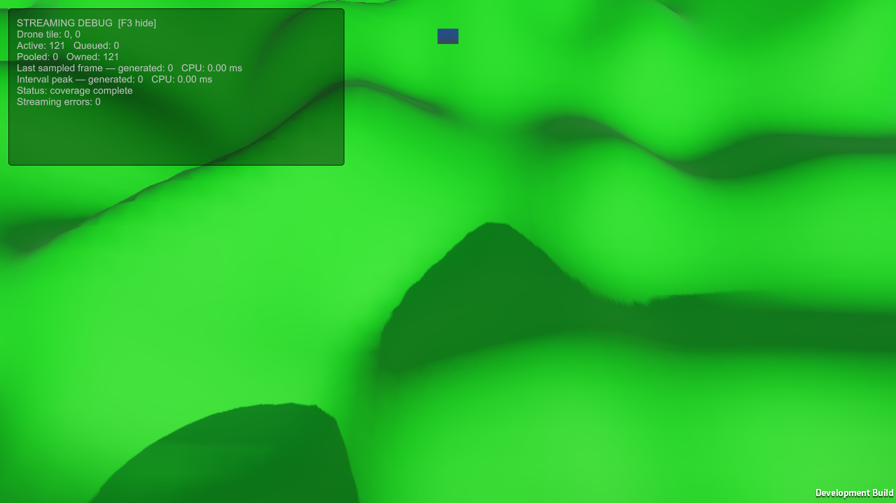
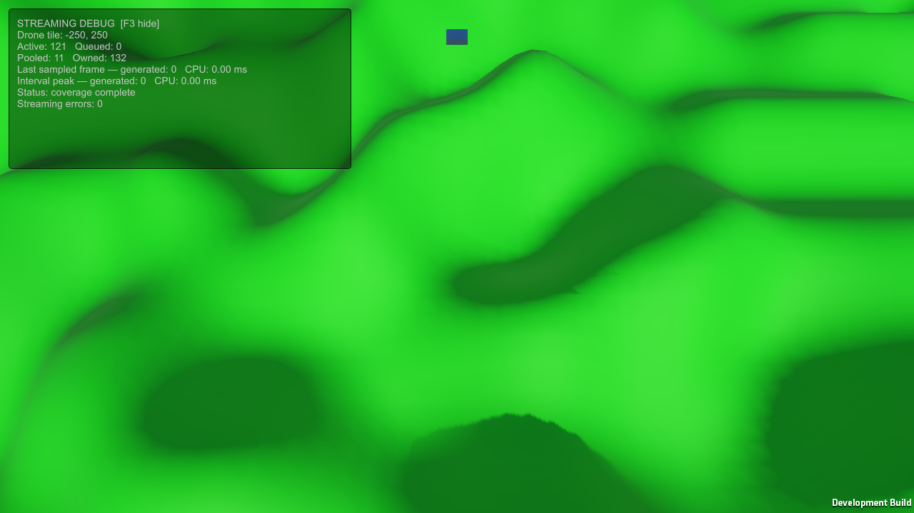

# Camera coverage baseline

MainScene now uses requested radius **5** (121 tiles) and retention margin **1** (active/ownership bound 169 tiles) for the agreed Drone flight range **Y=35–45**, with the saved camera and aspect ratios up to **16:9**. The previous scene requested radius 2 (25 tiles, bound 49). The controller remains configurable; a newly added component still has source field default 2. Generation remains synchronous with the unchanged four-chunk/2-ms soft budget. No camera pose or terrain-generation change is included.

## Camera measurement

Unity ViewportPointToRay measurements intersect the four saved-camera corner rays with ground planes Y=-1/0/20. Y=-1 adds a small margin below the expected terrain floor. At each Drone height and aspect, nine intra-tile positions at negative world coordinates exercise different offsets from the tracked tile center. The projected quadrilateral lies within its corner bounds for these downward-facing rays; the lowest ground plane gives the widest bounds. Far-clipping and terrain occlusion can reduce actual visible ground.

| Drone Y | Aspect | Required radius across sampled offsets/planes | Maximum relative X extent | Maximum relative Z extent |
|---|---|---:|---:|---:|
| 35 | 16:9 | 4 | 78.22 units | 64.21 units |
| 45 | 16:9 | 5 | 96.00 units | 81.53 units |
| 60 | 16:9 | 7 | 122.67 units | 107.51 units |
| 45 | 21:9 | 7 | 126.00 units | 81.53 units |

Full samples are in camera-coverage.csv. Radius 5 leaves a small geometric margin at the chosen maximum height. It does not guarantee coverage at greater heights, wider aspect ratios, changed camera FOV/pitch/offset, or while required tiles are still queued. The radius does not automatically adapt to camera settings.

## Correctness and rendered route

Unity 6000.3.12f1 Windows development build and all **201 runtime checks** passed. Scene startup/reload verify the new radius 5; the established lifecycle suite then normalizes to radius 2 and releases only available objects, preserving its existing coverage and ownership assertions.

The visible 1280x720 Direct3D12 route on NVIDIA GTX 1650 now uses the **saved camera throughout**, without the earlier harness camera override. Normal flight runs at the saved 5 units/second while rising from Y=35 to 45, followed by 300 units/second at Y=45, then a distant teleport and eight-second hold. These camera/altitude changes make earlier rendered-route performance numbers unsuitable for direct comparison.

Missing ground tiles count the conservative camera-corner bounding rectangle projected to Y=-1. This rectangle can include ground outside the exact frustum or behind terrain, so a missing tile is a coverage risk, not proof of visible missing pixels. Final missing count must be zero. Each sample also validates owned = active + pooled, the 169 ownership bound, and at most four generated chunks per frame.

| Route phase | Sampled frames | Frames with missing ground-bound tiles | Maximum missing tiles | Maximum queued | Maximum owned |
|---|---:|---:|---:|---:|---:|
| Normal flight / Y=35–45 | 297 | 0 | 0 | 7 | 132 |
| Fast flight / 300 units/s | 296 | 82 | 4 | 10 | 132 |
| Teleport and hold | 478 | 27 | 56 | 117 | 132 |

Final state: **121 active, 0 pending, 132 owned, 0 missing ground-bound tiles, 0 streaming errors**. Teleport coverage completed in 31 sampled frames, approximately 532 ms from the first teleport sample. Initial rendered startup coverage recorded 33 frames and 2.386 seconds from bootstrap; this includes cold startup/frame scheduling and should not be treated as pure generation CPU time.

The starting and final screenshots were inspected and show terrain covering the view, without the earlier exposed world edge. Temporary incomplete coverage is expected during startup and teleport loading. Fast flight still produces brief coverage risks; predictive prefetch or changes to request priority would be a separate follow-up.

Rendered draw-call means were approximately 155 / 156 / 152 across the three phases (maxima 161 / 165 / 161). GPU p95 samples were approximately 4.06 / 4.05 / 4.01 ms. Maximum sampled streaming CPU time during fast flight was 5.26 ms. The 2-ms time limit is soft: selection/release and individual generation cannot be interrupted. These instrumented, paced samples include the diagnostic harness, HUD and screenshot overhead; they do not establish release FPS or identify a bottleneck.

## Generation and memory comparison

A separate headless development-player run compared radii 2/3/5 using the same shared-normal generator. Automatic controller Update is disabled in that harness; cached delegates invoke its original methods. The budgeted scenarios use four chunks/2 ms; other scenarios explicitly remove the budget for comparison. Headless measurements have no rendering/GPU costs and are not directly comparable to the visible player's startup time.

| Budgeted scenario | Radius 2 | Radius 5 |
|---|---:|---:|
| Startup frames to full coverage | 7 | 31 |
| Startup time to full coverage | 100.43 ms | 501.26 ms |
| Startup maximum streaming CPU/frame | 1.18 ms | 1.33 ms |
| Fresh startup owned tiles | 25 | 121 |
| Startup Unity used-memory increase | 165.64 KiB | 802.34 KiB |
| Held teleport frames to full coverage | 7 | 31 |
| Held teleport time to full coverage | 100.02 ms | 502.63 ms |
| Held teleport maximum streaming CPU/frame | 1.16 ms | 2.03 ms |

The memory deltas include Unity/engine and managed allocations in each measured interval; they are not isolated GPU mesh residency or exact per-chunk sizes. The radius-5 startup interval used about 637 KiB more than radius 2 in this run. Scene object count increases by 4.84 times at initial coverage, while the retention bound increases from 49 to 169. Pooled objects retain their meshes, so reducing the buffer after a larger configuration does not automatically trim the historical pool high-water count.

The radius-5 30-second moving soak recorded 1,798 frames. Ownership stayed at **143 objects** throughout; Unity used memory increased by about **0.47 KiB**, with a sampled min-to-max range of **0.85 KiB**. Mono used memory increased by **100 KiB**, and Unity reserved memory increased by **2 MiB**, without forced GC. These engine-wide counters support bounded ownership and nearly flat Unity used memory over this route, not a general leak-free claim or exact chunk-memory attribution. The soak included a **13.77-ms** streaming outlier; attribution requires inspecting the profiler capture. No overall speedup is claimed.

The four-chunk cap held in all budgeted scenarios, including repeated teleports. Radius 5 is appropriate for the chosen normal-flight envelope, with measured startup/memory costs and documented loading gaps. Automatic camera-driven selection, predictive prefetch, pool trimming, and asynchronous generation remain unimplemented.

## Evidence and reproduction

Adjacent files contain camera measurements, build/runtime checks, source hashes, rendered samples/screenshots, and benchmark summaries plus radius-2/radius-5 frame/memory CSVs. Radius-3 raw CSVs and binary profiler captures remain in ignored Temp/CameraCoverageBenchmark; rendered binaries are in Temp/CameraCoverageRendered.

Reproduce with Tools/Validation/Verify-V0.ps1 -Benchmark -RenderedCheck -SoakSeconds 30. Keep the visible player unoccluded and inspect its screenshots; positive render counters alone do not establish that every capture is valid. The current recorded runs used the cached isolated Temp/V0Validation project with the changed scene and tools copied into it.
