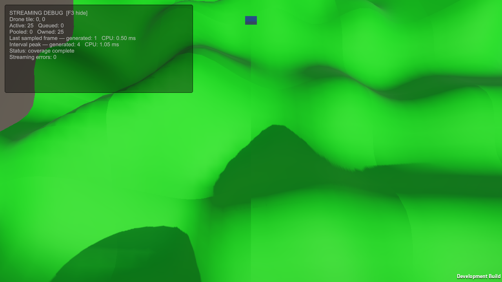

# Starting camera rig

MainScene previously placed the camera at world Y=0.8715 because its local offset inherited the Drone's nonuniform scale. The starting view was below the terrain.

The Drone root now has unit scale and starts at (0, 35, 0). Its mesh, renderer, and collider belong to a Drone Visual child with the original scale (0.6082, 0.16495962, 0.49368). The camera remains a child of the moving root, at local (0, 8, -12), with unit scale and a 60-degree downward pitch. The streaming controller still tracks the same root Transform. Movement speed and keys are unchanged.

This is a fixed starting pose. Manual altitude controls can still move below terrain; collision avoidance and terrain-following flight are not implemented.

## Validation

- Unity 6000.3.12f1 Windows development build succeeded in the isolated Temp/V0Validation project.
- All 188 runtime checks passed, including four checks for camera hierarchy, preserved visual/collider dimensions, initial height/orientation, and translation offset.
- Visible 1280x720 Direct3D12 development-player route completed on NVIDIA GTX 1650: final active=25, pending=0, owned=30, streaming errors=0. Positive draw/triangle samples were required by the harness.
- The screenshot below captures the saved scene camera after initial coverage completes, before the harness overrides its pose for the existing flight route. The subsequent route uses that override and is a streaming smoke check, not validation of the saved camera framing during every movement.

The saved view shows terrain from above. Shading seams and a small world-edge gap remain visible; this change does not establish complete frustum coverage. Shared-edge normals are the next visual correction. No performance improvement is claimed.

Build and runtime reports are adjacent to this file. Full route samples and the profiler capture remain in ignored Temp/CameraRigRendered. Reproduce using Tools/Validation/Verify-V0.ps1 -RenderedCheck.
