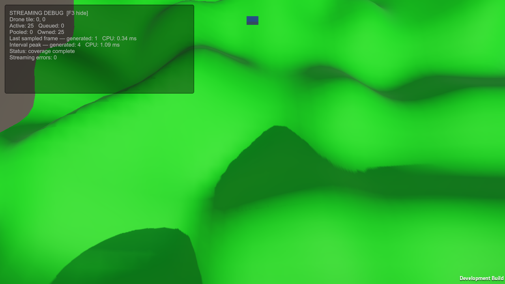
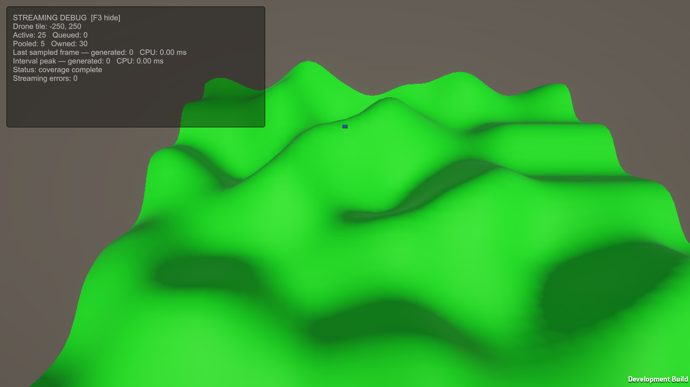

# Consistent terrain normals

Independent Mesh.RecalculateNormals calls produced different normals along shared tile edges. The earlier rendered route measured a maximum 16.615854-degree mismatch at tile (-250, 250) and its +X neighbor, despite matching heights.

TerrainGenerator now builds normals from central height differences in X and Z. It samples a one-vertex border outside the mesh, then normalizes (leftHeight - rightHeight, 2 * gridSpacing, backHeight - forwardHeight). Adjacent tiles use identical globally indexed samples, independent of neighboring object availability and generation order. These are smooth height-field normals, rather than averages of only the faces inside each tile.

Global sample coordinates are computed from integer grid indices with double intermediates, then converted to the height provider's float coordinates. Default 20-unit tiles at resolution 10 retain the original heights. Other sizes can have slightly different rounding from the previous tile-local coordinate expression. This does not solve float precision limits at extreme world coordinates, or seams between different LOD resolutions.

Vertices, triangles, normals, and halo heights remain reusable synchronous scratch buffers. At default resolution, height samples increase from 121 to 169 per tile. The new normal and height buffers add 2,128 bytes of payload per generator, plus array headers, allocated on resolution changes. No neighboring tiles are generated to obtain slopes. Mesh dimensions, triangle winding, pooling, queue behavior, and scene configuration are unchanged.

The profiler marker is now Terrain.BuildNormals, nested in Terrain.BuildMeshData; Terrain.ApplyMesh includes SetNormals. Old captures retain Terrain.RecalculateNormals. No timing improvement or allocation reduction is claimed; a fresh benchmark is needed for performance comparison.

## Validation

- Unity 6000.3.12f1 Windows development player built successfully.
- All 195 runtime checks passed, including exact shared-normal component equality on both axes/corners across positive and negative tiles and after a distant teleport, upward unit normals, expected border slope, unchanged default heights, changed resolution/noninteger size, and published-mesh independence during scratch-buffer reuse.
- Final visible 1280x720 Direct3D12 route on NVIDIA GTX 1650 completed: 25 active, 0 pending, 30 owned, 0 streaming errors. Maximum measured shared-edge angle at the same distant tile pair is now **0 degrees**.
- The saved initial camera view and final coverage screenshot were inspected. Lighting transitions across tile boundaries are smoother. Geometry shadows, finite world edges, and the simple material remain visible.

An earlier run produced a black final screenshot despite positive render samples earlier in the route. It was excluded from the saved evidence and repeated with the visible player left undisturbed; the repeated final screenshot contains terrain and the populated HUD. Positive counters alone do not prove every screenshot rendered correctly.

### Matching initial view

Before: [camera-rig starting screenshot](../2026-10-02-camera-rig/start-view.png).

After:

### Coverage after teleport

The flight route overrides the camera pose after the initial screenshot, as documented in the profiling runner. Frame intervals include pacing, rendering, overlay, profiling, and capture overhead; this is a visual/correctness smoke check, not a release performance benchmark. Reports, source hashes, screenshots, and raw route samples are adjacent. Profiler binaries remain in ignored Temp/SharedNormalsRenderedFinal. Reproduce with Tools/Validation/Verify-V0.ps1 -RenderedCheck.
